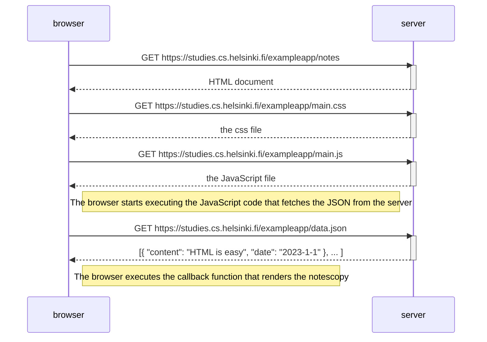
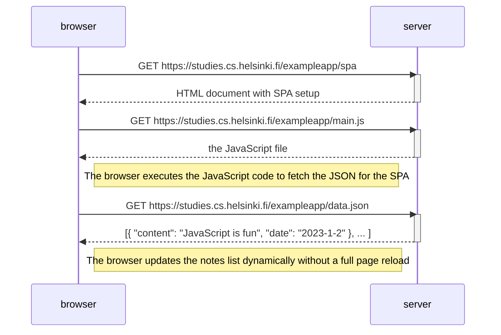
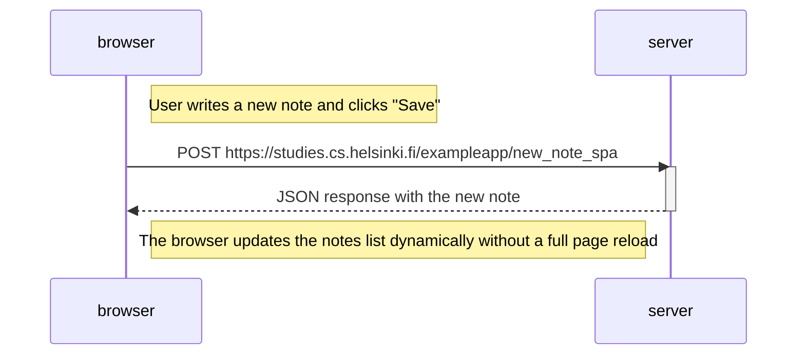

Here’s an example **README.md** file for the tasks and processes I’ve worked on, including the creation of the diagrams and the steps I followed.


# Project: Notes App (SPA and Traditional Version)

This repository contains the work done for creating diagrams for the **Notes App**, both in its traditional and single-page app (SPA) versions. The task involves demonstrating the sequence of events that occur when creating a new note, using Mermaid syntax for visualization in Markdown files.

##Tasks Completed

### **0.4: New Note Diagram (Traditional Version)**
In this task, I created a sequence diagram showing the process of opening the page `https://studies.cs.helsinki.fi/exampleapp/notes` and creating a new note. The flow follows these steps:
1. The browser sends a `GET` request for the main HTML, CSS, and JavaScript files.
2. The browser starts executing the JavaScript code, which fetches JSON data from the server.
3. The user writes a new note and clicks the "Save" button, triggering a `POST` request to the server with the new note data.

#### Sequence Diagram


### **0.5: Single Page App (SPA) Diagram**
For the SPA version, the flow of events changes slightly. The browser dynamically loads and displays the notes without requiring a full page reload. The sequence involves:
1. The browser sends a request to load the SPA version.
2. JavaScript is loaded and executes to interact with the server, fetching the notes.

#### Sequence Diagram


### **0.6: New Note in SPA Diagram**
This task depicts the sequence of events when the user creates a new note in the SPA version of the app. It follows these steps:
1. The user writes a new note and clicks the "Save" button.
2. The browser sends a `POST` request with the new note to the server.
3. The server responds with a success message, and the browser updates the notes list dynamically.

#### Sequence Diagram


## Process Followed

### 1. Understanding the Requirements
I first reviewed the task requirements and understood the flow of events that occur when interacting with the **Notes App**. This included:
- Opening the app in both the traditional and SPA versions.
- Adding a new note to the app and how it interacts with the server.

### 2. Diagram Creation with Mermaid Syntax
The task required me to visualize the sequence of events using **Mermaid syntax** in a Markdown file (`.md`). I created sequence diagrams that represent the communication between the **browser** and the **server** for various actions like:
- Fetching data when the app is loaded.
- Creating a new note and updating the UI dynamically.

### 3. Markdown Formatting and GitHub Visualization
All diagrams were written in **Markdown** format using **Mermaid** syntax. These files were made ready to be viewed directly on **GitHub**, as GitHub supports rendering Mermaid diagrams embedded in Markdown files.

### 4. GitHub Repository
All necessary files, including the Markdown files for the diagrams, are stored in this GitHub repository. These files are ready for submission and can be viewed and rendered on GitHub.

## Files in the Repository
- `spa_new_note.md`: Contains the Mermaid diagram for the new note creation process in the SPA version of the app.
- `spa_note_creation.md`: Contains the Mermaid diagram for the note creation process in the traditional version of the app.

## How to View Diagrams (https://github.com/Awikat/Fullstackopen.git)
1. Clone or download the repository. 
2. Open any `.md` file in GitHub or a Markdown viewer to see the rendered diagrams.

```sh

---

### Conclusion
The task was successfully completed by creating sequence diagrams that explain the user interaction in both traditional and SPA versions of the **Notes App**. These diagrams provide a clear understanding of how the app works and can be used as a reference for further development or educational purposes.

---


```
